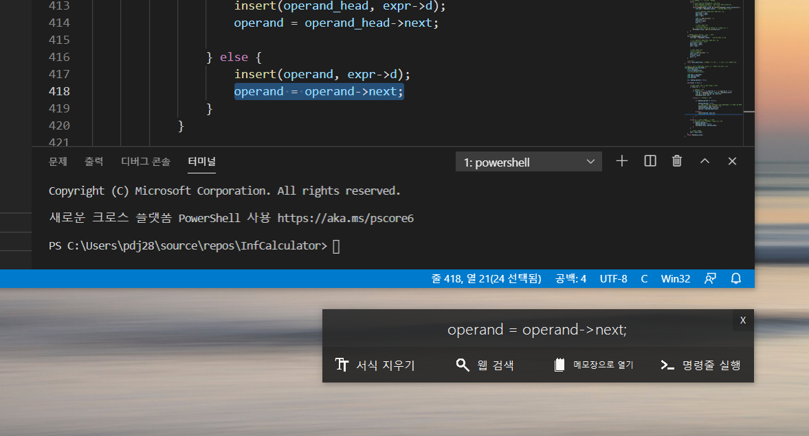

# bokboot
Simple Clipboard Utility Project (For 오픈소스SW기초)

## Summary (프로젝트 안내)
Windows에서 텍스트, 파일, 디렉토리를 복사하였을때 복사한 값의 서식을 지우거나, 웹 검색을 하거나, 파일 경로를 복사하는 등의 작업을 할 수 있도록 도와주는 오픈소스 유틸리티 프로젝트

## Merge Conflict 부분 (중간고사 대체과제)
Commit: [Merge pull request #5 from pdjdev/experimental](https://github.com/pdjdev/bokboot/commit/fc067a12914acca89c06038857ae6a92715d1108)

## 보고서 (기말고사 대체과제)
### [문서 링크](/final_exam)

## 참여 인원
[@pdjdev](https://github.com/pdjdev)

